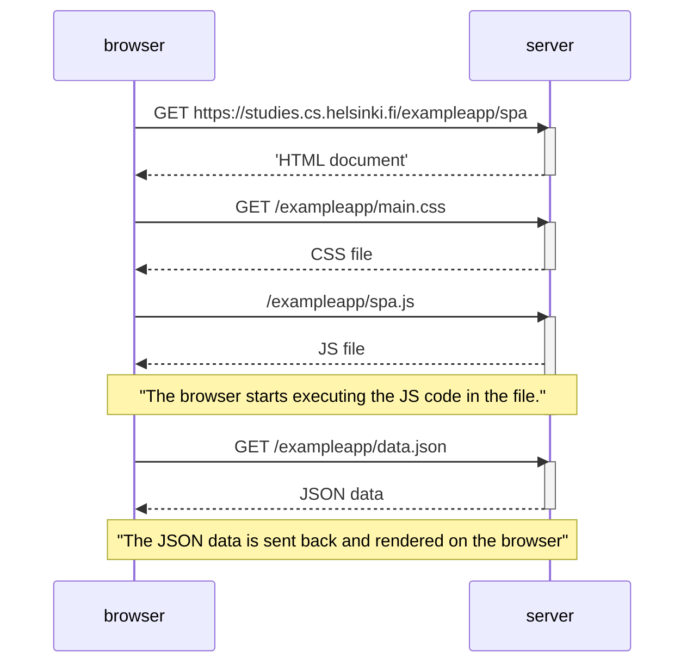

```mermaid
sequenceDiagram
    participant browser
    participant server

    browser->>server: GET https://studies.cs.helsinki.fi/exampleapp/spa 
    activate server
    server-->>browser: 'HTML document'
    deactivate server
    browser->>server: GET /exampleapp/main.css
    activate server
    server-->>browser: CSS file
    deactivate server
    browser->>server: /exampleapp/spa.js
    activate server
    server-->>browser: JS file
    Note over browser,server: "The browser starts executing the JS code in the file."
    deactivate server
    browser->>server: GET /exampleapp/data.json
    activate server
    server-->>browser: JSON data
    deactivate server
    Note over browser, server: "The JSON data is sent back and rendered on the browser"
```
