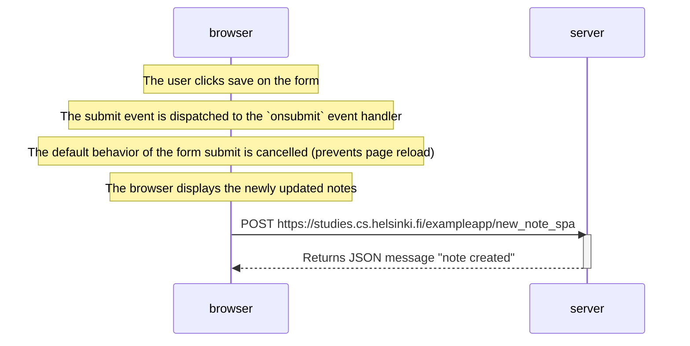

```mermaid
sequenceDiagram
    participant browser
    participant server

    Note over browser: The user clicks save on the form
    Note over browser: The submit event is dispatched to the `onsubmit` event handler
    Note over browser: The default behavior of the form submit is cancelled (prevents page reload)
    Note over browser: The browser displays the newly updated notes
    browser->>server: POST https://studies.cs.helsinki.fi/exampleapp/new_note_spa 
    activate server
    server-->>browser: Returns JSON message "note created"
    deactivate server
```
